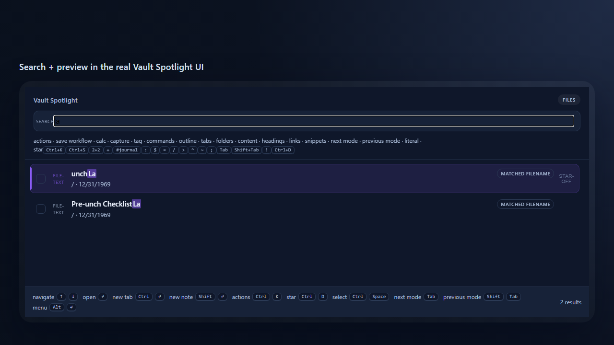
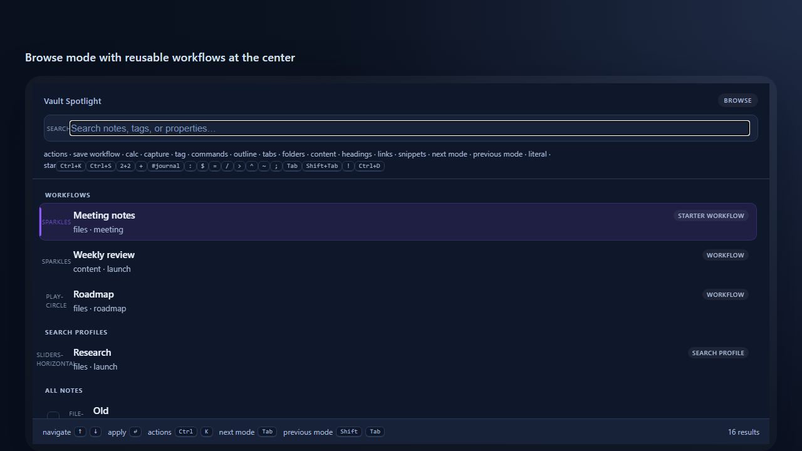

# Vault Spotlight

> A Raycast-style command center for [Obsidian](https://obsidian.md): find notes fast, reopen recurring work instantly, and act on results — all without leaving the keyboard.



Vault Spotlight is a keyboard-first command center for three jobs: **Search**, **Workflows**, and **Actions**.

In 5 seconds, here's why people install it:

- **Find the right note fast** — fuzzy search, commands, headings, links, folders, and open editors in one launcher.
- **Reopen repeated work instantly** — save a search as a workflow and bring back the same project, meeting, or follow-up context in one keystroke.
- **Do useful work immediately** — open, copy, rename, batch-edit, export, or preview results without breaking keyboard flow.

Free is useful on day one. Pro adds deeper search, unlimited workflows, and batch actions for people who live in the launcher.

## Why it clicks

- **Jump anywhere fast.** Type a few letters to open any note, run any command, or jump to a heading — with recents and open tabs boosted so the thing you want is usually first.
- **Bring back recurring work.** Save a search you run often as a workflow and relaunch it from Browse in one keystroke.
- **Stay in flow.** Press `Cmd/Ctrl+K` on a result to open it, copy it, rename it, or act on it without dropping into file-by-file cleanup.

## Browse mode and workflows



Typical use cases:

- **Daily work hub** — bounce between active project notes, meeting notes, and follow-ups from one launcher.
- **Writer / researcher flow** — save recurring searches for drafts, sources, reading queues, and literature notes.
- **Operations / client work** — collect a result set, then rename, tag, move, export, or turn it into a MOC without hand-editing files one by one.

---

## Search

*Find the right note, command, or vault object fast.*

- **Fuzzy file launcher** — partial names, initials, and light typos; recent files and open editors are boosted automatically.
- **Modes without menus** — `Tab`/`Shift+Tab` (or a configurable prefix) cycles files, commands (`:`), symbols in the active note (`$`), open editors (`=`), and folders (`/`). Drill from a file result into its outline (`$`) or links (`~`) without opening it.
- **Tag & property filters** — narrow with `#work`, `@status:done`, or a name plus metadata filters.
- **Content & heading search (Pro)** — search inside note bodies (`>`) and jump straight to a heading anywhere in the vault (`^`); browse backlinks/outlinks with links mode (`~`).
- **Ranking you can trust (Pro)** — choose balanced, filename-, recency-, metadata-, or alias-first ranking, with optional **match-reason badges** so you can see *why* a result surfaced instead of guessing.

## Workflows

*Reopen repeated work in one keystroke.*

- **Save the current search** — mode + query (+ ranking) — with `Cmd/Ctrl+S`, then re-run it from the Browse screen. Workflows are the one saved object; pin the ones you use daily.
- **Free includes 2 saved workflows**; **Pro is unlimited** and can seed curated starters (recent work, follow-ups, meetings).
- **Optional profile context (Pro)** — a workflow can also restore a saved set of file-type toggles, excluded folders, and preview preference. This is advanced depth, not a separate front-door concept.

## Actions

*Do useful work immediately after finding something.*

- **Action palette (Free)** — press `Cmd/Ctrl+K` on any result to open it, copy a Markdown link or path, or rename it. (Right-click or `Alt+Enter` adds context actions like reveal-in-system-explorer.)
- **Batch actions (Pro)** — select a working set with `Cmd/Ctrl+Space`, then open them all, add/remove a tag, set a frontmatter property, move files, or turn the results into a map-of-content note.
- **Export (Pro)** — copy selected/current results as Markdown links, or create a search-results note for handoff.
- **Starred pins (Pro)** — `Cmd/Ctrl+D` keeps high-value files at the top of Browse and results.

## Quick actions

*Instant tools right from the input bar — no mode-switching, no leaving search.*

- **Calculator & converter (Free)** — `1234*0.19`, `20% of 250`, `10 km to mi`, `72f to c`, `40 USD to EUR`; `Enter` copies the answer, `Shift+Enter` inserts it. Currency uses offline rates you control — no network, ever.
- **Date jump (Free)** — `today`, `next friday`, `in 3 weeks`, or an ISO date opens (or creates) that day's daily note, honoring your Daily/Periodic Notes settings.
- **Quick capture (Free)** — press `+`, jot a thought, and `Enter` appends it to today's daily note *without opening it*. Pro adds an inbox target, prepend, and append-under-a-heading.
- **Snippets (Pro)** — press `;` to fuzzy-find reusable snippets and insert them at the cursor, with `{{date}}`, `{{time}}`, `{{clipboard}}`, `{{selection}}`, and `{{cursor}}` placeholders.

---

## Free vs Pro

Free is a genuinely useful launcher on its own. **Pro ($8 one-time)** turns Spotlight into a reusable work cockpit — repeated leverage, richer actions, and deeper search. Basic file operations stay free.

| Area | Free | Pro |
| --- | --- | --- |
| File launcher, commands, symbols, editors, folders | Yes | Yes |
| Tag / property filters in file search | Yes | Yes |
| Calculator, converters, date jump, quick capture | Yes | Yes |
| Saved workflows | 2 | Unlimited + starters |
| Rename & context actions on a result | Yes | Yes |
| Body content search (`>`) and heading search (`^`) | No | Yes |
| Links mode, live preview pane | No | Yes |
| Ranking controls & match-reason badges | No | Yes |
| Action palette (`Cmd/Ctrl+K`): open, copy, rename | Yes | Yes |
| Batch actions, export, starred pins | No | Yes |
| Snippets, capture to inbox / under a heading | No | Yes |
| Search profiles, aliases, advanced query language | No | Yes |
| Canvas / PDF / Bases discovery & search | No | Yes |
| Offline license verification | n/a | Yes |

Purchase: [Buy Me a Coffee — Vault Spotlight Pro](https://buymeacoffee.com/vaultspotlight). License keys are verified **offline** (Ed25519) — no account, server, or subscription.

---

## Advanced capabilities

For power users; not required to get value from Spotlight.

- **Advanced query language (Pro)** — combine quoted phrases, exclusions, and filters:
  ```text
  "launch plan" -archive in:Projects modified:7d
  name:roadmap tag:client prop:status=active
  is:starred ext:md
  ```
- **Search aliases (Pro)** — personal shortcuts like `crm = in:Clients @type:client` that expand before search.
- **Search profiles (Pro)** — workspace-style contexts (writing, research, clients, PDFs) that a workflow can restore.
- **Ripgrep acceleration (Pro)** — uses `rg` when available for faster full-vault content search, with a seamless fallback to the built-in index (which runs off the main thread on large vaults). Common install locations (winget, scoop, chocolatey, Homebrew, VS Code's bundled `rg`) are auto-detected.
- **Canvas / PDF / Bases (Pro)** — include Canvas files and PDFs in file search, search text inside Canvas nodes, and search Bases (`.base`) view/filter definitions; `> status active` finds the base that queries it.
- **Integrations (Pro)** — hand off to Omnisearch / Text Extractor when installed; with [Bases Power Pack](https://github.com/israerusan/bases-power-pack) 1.2.0+, `Cmd/Ctrl+K` on a `.base` result offers "Open in Kanban/Calendar/Gantt view".
- **Customizable triggers** — every mode prefix is configurable, with an escape character (`!`) to search trigger characters literally.

## Automation & API

- **URL scheme** — `obsidian://vault-spotlight?vault=YourVault&query=launch%20plan&mode=content` opens the modal with a prefilled query and mode (`files`, `content`, `headings`, `symbols`, `commands`, `links`, `editors`, `folders`).
- **Global API** — `globalThis.vaultSpotlight` exposes `open(query?, mode?)`, `search(query)` (Promise of `{ path, basename, line, snippet, score, engine }`; Pro-gated, resolves `[]` on free), and `isProActive()`.

## Privacy & data

Vault Spotlight never phones home. All state lives in the plugin's local `data.json`: your settings plus ranking data (recent paths, starred paths, per-file open counts, recent queries). Because that includes note paths and query text, add `.obsidian/plugins/vault-spotlight/data.json` to `.gitignore` if you commit your `.obsidian` folder.

## Install

**Manual:** copy `main.js`, `manifest.json`, and `styles.css` into `.obsidian/plugins/vault-spotlight/`, then enable **Vault Spotlight** in Settings → Community plugins. Open from the ribbon icon or bind a hotkey to *Open spotlight* (no default hotkey, per Obsidian guidelines).

**Community directory:** search **Vault Spotlight** in Settings → Community plugins.

## Activate Pro

1. Purchase on [Buy Me a Coffee](https://buymeacoffee.com/vaultspotlight).
2. You'll receive a license key by email (usually within 24 hours).
3. Obsidian → Settings → Vault Spotlight → paste the key. Pro unlocks immediately (offline verification).

## Development

```bash
npm install
npm run build
npm test        # typecheck + lint + full suite, incl. the fixture-vault & modal harnesses
```

Listed as **Optional payments** in the Obsidian Community directory (free core + paid Pro unlock). Issues and feature requests welcome on GitHub.
